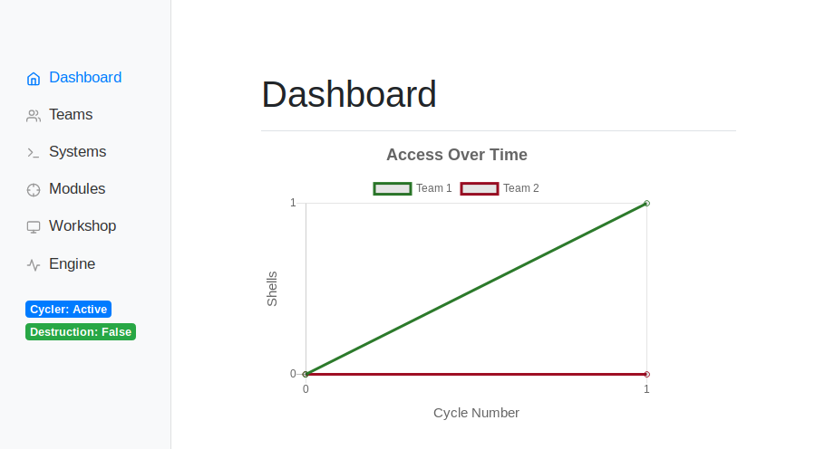
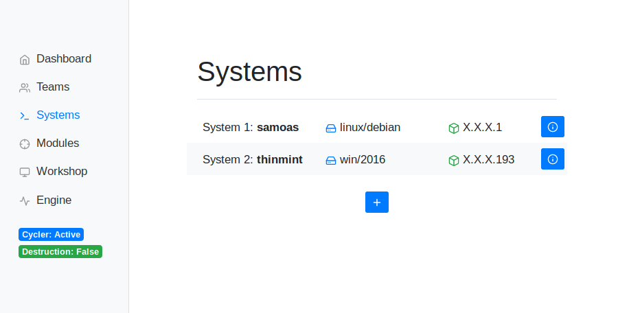
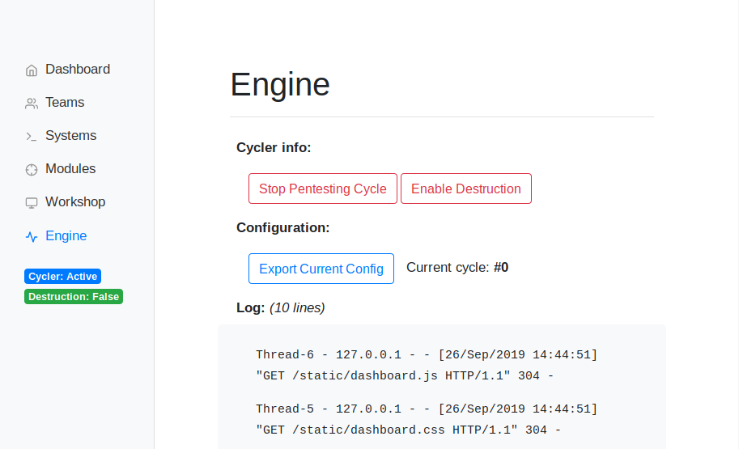

# Red Team Automation Engine (RTE)

A modular Python system for automating a red team for blue team cyber defense competitions.

Requirements:
- python3: `apt install python3 python3-pip python3-dev`
    - python3 packages: `pip3 install Flask pymysql msgpack`
- `mysql` database
- [metasploit framework](https://metasploit.help.rapid7.com/docs/installing-the-metasploit-framework)
  - `msfrpcd` with functional database (run `msfrpcd` to set up)

Usage:
`python3 app.py [autostart]`

## Screenshots





## How it Works

There are four main components to the engine.

- __Web Interface__: The webapp (made with Flask) supports viewing and editing information about the systems and teams.
- __Pentesting Cycle__: The engine will run through these steps continuously.
    - _Entry_: The engine uses the current vulns to gain access if there are not enough current shells.
    - _Persisting_/_Post_: Randomly selecting persistence modules based on os and difficulty, the engine creates more vulns and backdoors or collects loot. This is skipped if there are enough backdoors (depending on difficulty).
    - _Annoying_: Randomly selected annoy modules (based on os and difficulty) are selected and run.
    - _Scanning_: If any modules for the os support scanning, they are run. (#todo probably move this to run-once)
- __MetaSploit Framework__: The MS Framework and MSFRPC is used extensively. The MSGRPC process is threaded by the cycler, and used by modules through the `pymsf` module.
- __Modules__: Modular pieces of Python code allow the engine to enter, persist, or annoy on systems. More details in _Modules_ section.

## Modules

There are a few restrictions that make the engine more reliable.

1. Each team always has the same set of systems.
2. Each team and systems start with the same vulns (but can change as the competition progresses).
3. All `entry` modules must return a MSF session.

With the universal MSFRPC entry, scripts of all types (bash, powershell, another metasploit module) can be run much easier. `entry` scripts can also be written in bash or powershell, but it must return a session by using the multi/handler exploit to catch the reverse shell (or some other method).

There are three types of modules:

1. `entry` modules are used to gain code execution on the system (ex. `entry_linux_ssh`)
    - `handle()` function takes `(system, vuln, msf)`
2. `persist` or `post` modules are used to create more vulns on the system or collect loot/info (ex `post_linux_acc`).
    - `handle()` function takes `(system, session)`
3. `annoy` modules are used to mess with the system (ex. `annoy_linux_killprogs`)
    - `annoy` modules have a `destructive` attribute (`"True" / "False"`).
    - `handle()` function takes `(system, session)`

Look at the example modules listed above, they can be used to create another. Make sure to set the variables at the top of the file accurately. See `entry_linux_ssh` for a well-commented module.

### PyMsf

In order to interact with MSF, `pymsf.py` contains functions to perform actions easier than directly interacting with the RPC API. It is based on SpiderLab's python `msfrpc` class.

## Configuration

This sample configuration should be self-explanatory.

```
settings:
    password: TripleWater

teams:
    team1:
        team_name: Byte Sized Falcons
        prefix: 192.168.86.
        difficulty: 1
    team2:
        team_name: CyberDogs
        prefix: 192.168.1.
        difficulty: 1

systems:
    system1:
        name: samoas
        os: linux
        flavor: debian
        ip: 80
        vulns:
            vuln1:
                name: entry_any_webshell
                info: ('80', '/?cmd=', 'GET')
            vuln2:
                name: entry_linux_ssh
                info: ('22', 'root', 'girlscoutssuck#123')
    system2:
        name: trefoils
        os: win
        flavor: 2008R2
        ip: 91
        vulns:
            vuln1:
                name: entry_any_webshell
                info: ('80', '/?cmd=', 'GET')
```

## Filesystem

See below for the commented project filesystem.

```
.
├── app.log # Log for everything in the project (import logging)
├── app.py # Entry point and main python file
├── config.yaml # Configuration file
├── engine
│   ├── cycle.py # Main cycler file. Responsible for executing modules
│   ├── db.creds # Credentials for database
│   ├── db.py # Database helper functions
│   ├── __init__.py # 0-byte init in order to import engine as module
│   ├── load_config.py # Script that loads the config into the db
│   ├── model.py # Data model of classes for entire project
│   └── schema.sql # Database schema (MySQL)
├── modules
│   ├── annoy_*.py # Annoy modules
│   ├── entry_*.py # Entry modules
│   ├── persist*.py # Persist/post modules
│   ├── __init__.py # Init script automatically importing modules
│   ├── module_info.py # File containing list of all modules
│   ├── pymsf.py # Python-MSFRPC helper functions
│   └── scripts
│       └── os_scriptname*.sh # All scripts for use with modules
├── README.md
├── static # Static files (js, css) for web
└── templates # Templates for web
```


## Modules

### Entry Modules

- `entry_any_webshell`: module for exploting php shells.
    - opt1:
    - opt2:
    etc

### Persist / Post Modules

### Annoy Modules


### Creating a Module

Just follow the commetns and structure in a module type you're trying to create. Once you're done, add it to `modules/module_info.py`.


Thanks to Jake Hince for help :)
